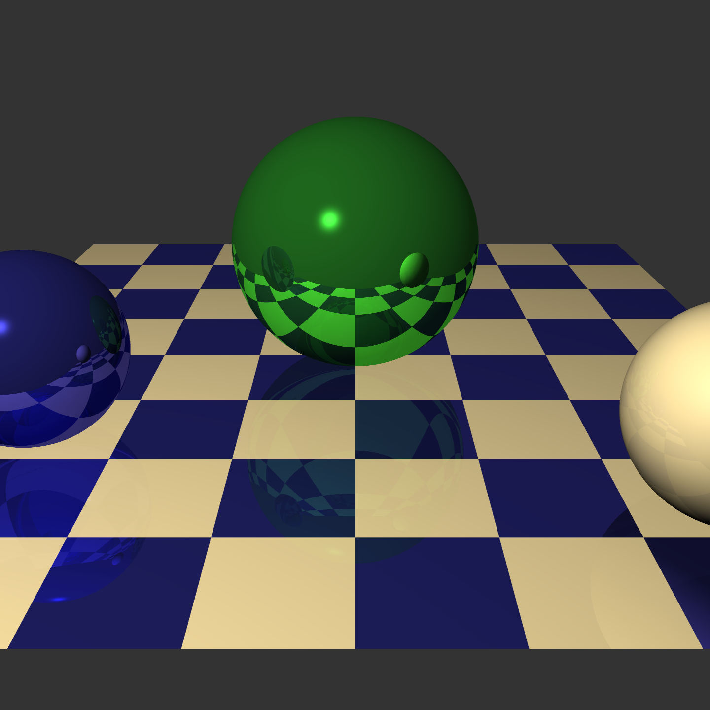

# C++ Raytracer
Copyright © 1990 Bart Massey

In about 1990, I wrote a little raytracer in C++ as the
course project for a computer graphics class at
U. Oregon. About 5000 lines; seemed like a great way to
learn the language.

Turns out I hate C++.

The scene is hard-coded to this:

Anyway, Julian Kongslie got my raytracer up to date and
running again in 2007, fixing a long-outstanding memory
allocation bug that caused slight indeterminism in the
results.

This code has some OK reusable classes, and is not
implausibly slow on a modern box. (In 2022, 1000x1000 takes
me about 3.5s with 3×3 antialiasing. In 1990, 100x100
without antialiasing was minutes.)

Build with `make`, run with e.g. `./render 1440 1440`. Turns
out non-square renders come out distorted. Should probably
fix that someday.

This work is available under the "BSD License". Please see
the file COPYING in this distribution for license terms.
